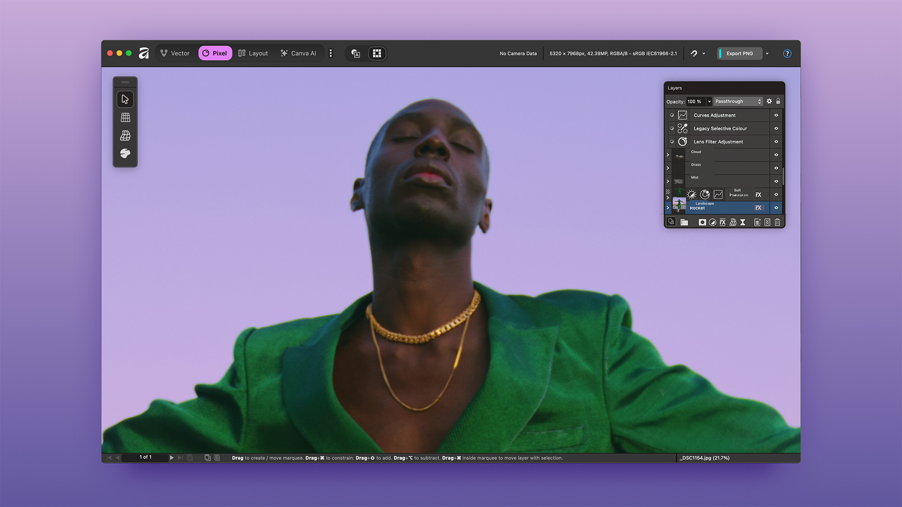

# 🚀 Zenn Article Audio Reader - GitHub Pages デプロイガイド

> **作成日**: 2025/11/09  
> **最終更新**: 2025/11/09  
> **ステータス**: ✅ 本番稼働中

---

## 📋 目次

1. [プロジェクト概要](#プロジェクト概要)
2. [GitHub Pages デプロイ完全ガイド](#github-pages-デプロイ完全ガイド)
3. [ディレクトリ構造とパス設計](#ディレクトリ構造とパス設計)
4. [トラブルシューティング完全版](#トラブルシューティング完全版)
5. [開発履歴とナレッジベース](#開発履歴とナレッジベース)

---

## 🎯 プロジェクト概要

### 基本情報

- **プロジェクト名**: Zenn Article Audio Reader
- **目的**: Zenn記事を高品質な音声で朗読するWebアプリケーション
- **デプロイ方式**: GitHub Pages（静的サイトホスティング）
- **本番URL**: https://tenormusica2024.github.io/zenn-ai-news/
- **リポジトリ**: https://github.com/Tenormusica2024/zenn-ai-news

### 技術スタック

- **フロントエンド**: HTML5, CSS3, JavaScript (Vanilla)
- **音声合成**: Google Cloud TTS (Neural2音声)
- **音声形式**: MP3 (チャンク分割対応)
- **プレイヤー**: Web Audio API
- **ホスティング**: GitHub Pages (静的サイト)
- **開発サーバー**: Node.js HTTP Server (Range Requests対応)

### 主要機能

1. **複数記事管理**: プレイリスト形式で複数記事を管理
2. **チャンク分割再生**: 長文記事を複数チャンクに分割して連続再生
3. **音声制御**: 再生速度調整 (0.5x - 2.0x)、音量調整、シーク操作
4. **レスポンシブデザイン**: デスクトップ・モバイル両対応
5. **いいね機能**: ローカルストレージ使用
6. **ポートフォリオ統合**: フッターにポートフォリオサイトへの戻るリンク

---

## 🚀 GitHub Pages デプロイ完全ガイド

### 1. ブランチ戦略

#### ブランチ構成

```
master (main)
├── feature/article-audio-reader-clean  ← GitHub Pages公開ブランチ（本番）
└── 他の開発ブランチ
```

**重要**: GitHub Pagesは `feature/article-audio-reader-clean` ブランチから公開

#### ブランチ選択の理由

- **クリーンな履歴**: 大容量ファイル・機密情報を含まない
- **安定性**: テスト済みの安定したコード
- **分離**: 開発作業と本番環境の分離

### 2. GitHub Pages 設定手順

#### Settings → Pages 設定

1. GitHubリポジトリ → **Settings** タブ
2. 左メニュー → **Pages**
3. **Source** セクション:
   - Branch: `feature/article-audio-reader-clean`
   - Folder: `/ (root)`
4. **Save** をクリック

#### 公開URL確認

- 設定完了後、数分で以下のURLで公開される:
  ```
  https://tenormusica2024.github.io/zenn-ai-news/
  ```

### 3. デプロイワークフロー

#### 標準デプロイフロー

```bash
# 1. ファイル編集
# （index.html, audio-reader/ 配下など）

# 2. Git操作
cd "C:\Users\Tenormusica\Documents\zenn-ai-news"
git add .
git commit -m "機能追加/修正内容の説明"
git push origin feature/article-audio-reader-clean

# 3. GitHub Pages自動デプロイ
# プッシュ後、1-2分で自動デプロイ完了

# 4. キャッシュクリア + 確認
# ブラウザで Ctrl+Shift+R (強制リフレッシュ)
# または新規シークレットウィンドウで確認
```

#### デプロイ確認コマンド

```bash
# HTTPステータスコード確認
curl -I https://tenormusica2024.github.io/zenn-ai-news/

# 期待結果: HTTP/2 200
```

---

## 📁 ディレクトリ構造とパス設計

### プロジェクトルート構造

```
zenn-ai-news/
├── index.html                              # メインHTMLファイル（エントリーポイント）
├── .gitignore                              # Git除外設定
├── README.md                               # プロジェクト説明
├── DEPLOYMENT_GUIDE.md                     # 本ファイル
│
├── audio-reader/                           # 音声リーダー本体
│   ├── audio/                              # 音声ファイル格納
│   │   ├── affinity-3-free-canva-ai-strategy-2025/
│   │   │   ├── article_ja-male_chunk_01.mp3
│   │   │   ├── article_ja-male_chunk_02.mp3
│   │   │   ├── article_ja-male_chunk_03.mp3
│   │   │   ├── article_ja-female_chunk_01.mp3
│   │   │   ├── article_ja-female_chunk_02.mp3
│   │   │   ├── article_ja-female_chunk_03.mp3
│   │   │   └── playlist.json               # メタデータ
│   │   │
│   │   └── ai-agents-70-percent-failure-reality-2025/
│   │       ├── article_ja-male_chunk_01.mp3
│   │       ├── article_ja-male_chunk_02.mp3
│   │       ├── article_ja-female_chunk_01.mp3
│   │       ├── article_ja-female_chunk_02.mp3
│   │       └── playlist.json
│   │
│   ├── web/                                # Webアセット
│   │   ├── affinity-thumbnail.jpg          # サムネイル画像1
│   │   └── ai-agents-thumbnail.jpg         # サムネイル画像2
│   │
│   ├── scripts/                            # 音声生成スクリプト
│   │   ├── generate_article_audio.js       # 統合スクリプト
│   │   └── generate_tts_audio.py           # Google Cloud TTS実装
│   │
│   ├── venv_kokoro/                        # Python仮想環境（.gitignore）
│   ├── server.js                           # 開発用HTTPサーバー
│   ├── service-account-key.json            # Google Cloud認証キー（.gitignore）
│   └── README.md                           # audio-reader説明
│
└── articles/                               # Markdown記事ソース（非公開）
    ├── affinity-3-free-canva-ai-strategy-2025.md
    └── ai-agents-70-percent-failure-reality-2025.md
```

### パス設計の重要ポイント

#### GitHub Pagesのベースパス

```
https://tenormusica2024.github.io/zenn-ai-news/
```

- リポジトリ名 `zenn-ai-news` がベースパスに含まれる
- すべてのリソースパスはこのベースを基準にする

#### 正しいパス記述

**HTML内のリソースパス（index.html）:**

```html
<!-- ✅ 正しい: 相対パス（GitHub Pages対応） -->

<audio id="audio" src="audio-reader/audio/affinity-3-free-canva-ai-strategy-2025/article_ja-male_chunk_01.mp3"></audio>

<!-- ❌ 間違い: 絶対パス（ローカル専用） -->

```

**JavaScript内のfetchパス:**

```javascript
// ✅ 正しい: ベースパス不要（相対パス）
const response = await fetch('audio-reader/audio/affinity-3-free-canva-ai-strategy-2025/playlist.json');

// ❌ 間違い: 先頭に / をつけない
const response = await fetch('/audio-reader/audio/...');
```

**理由:**
- GitHub Pagesでは `/` から始まるパスは `https://tenormusica2024.github.io/` を指す
- リポジトリ名 `/zenn-ai-news/` が抜けてしまう

---

## 🔧 トラブルシューティング完全版

### 問題1: 音声ファイルが404エラー

#### 症状

```
Failed to load resource: the server responded with a status of 404 (Not Found)
https://tenormusica2024.github.io/audio/affinity-3-free-canva-ai-strategy-2025/article_ja-male_chunk_01.mp3
```

#### 原因

1. **パスが間違っている** - `/audio/` ではなく `audio-reader/audio/`
2. **ファイルがGitに含まれていない** - `.gitignore` で除外されている
3. **ブランチが間違っている** - `master` ではなく `feature/article-audio-reader-clean`

#### 解決方法

```bash
# 1. .gitignore確認
cat .gitignore
# → audio-reader/venv_kokoro/ のみ除外されていることを確認

# 2. 音声ファイルがGit管理下にあるか確認
git ls-files audio-reader/audio/

# 3. ファイルがない場合、追加
git add audio-reader/audio/
git commit -m "音声ファイルを追加"
git push origin feature/article-audio-reader-clean

# 4. GitHub Pagesで確認
# 1-2分後に https://tenormusica2024.github.io/zenn-ai-news/ でアクセス
```

### 問題2: サムネイル画像が表示されない

#### 症状

- ブラウザコンソールに404エラー
- 画像の代わりに壊れたアイコンが表示される

#### 原因

1. **パスが間違っている** - `/web/` ではなく `audio-reader/web/`
2. **ファイル名が違う** - `thumbnail.jpg` ではなく `affinity-thumbnail.jpg`
3. **大文字小文字の違い** - `Thumbnail.jpg` ではなく `thumbnail.jpg`（Linux環境では厳密）

#### 解決方法

```bash
# 1. ファイルの存在確認
ls -la audio-reader/web/

# 2. index.html内のパス確認
grep -n "thumbnail" index.html

# 3. パス修正（index.html）
# ❌ src="/web/affinity-thumbnail.jpg"
# ✅ src="audio-reader/web/affinity-thumbnail.jpg"

# 4. Git操作
git add index.html
git commit -m "サムネイルパス修正"
git push origin feature/article-audio-reader-clean
```

### 問題3: ローカルで動作するがGitHub Pagesで404

#### 原因分析チェックリスト

```bash
# 1. ブランチ確認
git branch
# → feature/article-audio-reader-clean にいるか？

# 2. GitHub Pages設定確認
# Settings → Pages → Branch が feature/article-audio-reader-clean か？

# 3. ファイルがプッシュされているか確認
git log --oneline -5
git ls-files | grep "audio-reader"

# 4. GitHub上でファイル確認
# https://github.com/Tenormusica2024/zenn-ai-news/tree/feature/article-audio-reader-clean
# → audio-reader/audio/ 配下にMP3ファイルが見えるか？
```

### 問題4: キャッシュで変更が反映されない

#### 症状

- コードを修正してプッシュしたのに古い内容が表示される
- デベロッパーツールで見ると古いコードが読み込まれている

#### 解決方法

**レベル1: 強制リフレッシュ**
```
Ctrl + Shift + R (Windows)
Cmd + Shift + R (Mac)
```

**レベル2: キャッシュクリア + リロード**
```
1. F12 でデベロッパーツール起動
2. Networkタブ → "Disable cache" にチェック
3. リロードボタンを右クリック → "Empty Cache and Hard Reload"
```

**レベル3: シークレットウィンドウ**
```
Ctrl + Shift + N (Windows)
Cmd + Shift + N (Mac)
新規ウィンドウで https://tenormusica2024.github.io/zenn-ai-news/ にアクセス
```

### 問題5: GitHub Pagesのデプロイが完了しない

#### 確認方法

```bash
# 1. GitHub Actions確認
# https://github.com/Tenormusica2024/zenn-ai-news/actions
# → pages-build-deployment ワークフローが成功しているか確認

# 2. デプロイログ確認
# Actionsタブ → 最新のpages-build-deployment → ログを確認

# 3. デプロイ状態確認
# Settings → Pages → "Your site is live at https://..." が表示されているか
```

#### よくあるエラーと対処

**エラー: ファイルサイズが大きすぎる**
```
Error: File size exceeds 100 MB
```

対処:
```bash
# 大容量ファイルを.gitignoreに追加
echo "large-file.mp3" >> .gitignore
git rm --cached large-file.mp3
git commit -m "大容量ファイル除外"
git push origin feature/article-audio-reader-clean
```

**エラー: ブランチが見つからない**
```
Error: Branch not found
```

対処:
```bash
# Settings → Pages → Branchを再設定
# feature/article-audio-reader-clean を選択 → Save
```

---

## 📚 開発履歴とナレッジベース

### 2025-11-09: GitHub Pages デプロイ完了

#### 実施内容

1. **音声ファイル404エラー解決**
   - パス修正: `/audio/` → `audio-reader/audio/`
   - `.gitignore` 見直し（音声ファイルは除外しない）
   - Git管理下に音声ファイルを追加

2. **サムネイル画像404エラー解決**
   - パス修正: `/web/` → `audio-reader/web/`
   - 画像ファイルをGit管理下に追加

3. **GitHub Pages設定完了**
   - ブランチ: `feature/article-audio-reader-clean`
   - フォルダ: `/ (root)`
   - 公開URL: https://tenormusica2024.github.io/zenn-ai-news/

4. **フッター追加**
   - ポートフォリオサイトへの戻るボタン
   - GitHubリポジトリリンク
   - ai-trend-dailyと同様のデザイン

#### 学んだこと

**GitHub Pagesのパス設計:**
- リポジトリ名がベースパスに含まれる
- 相対パスを使用すべき（`/` から始めない）
- ローカルと本番で同じパスにする

**デバッグ手法:**
- ブラウザコンソールでパス確認
- `git ls-files` でGit管理状況確認
- GitHub上のファイルブラウザで最終確認

**キャッシュ対策:**
- Ctrl+Shift+R で強制リフレッシュ
- シークレットウィンドウで確認
- デベロッパーツールでDisable cache

### 2025-11-08: Google Cloud TTS実装

#### 主要変更

- gTTS → Google Cloud TTS (Neural2音声) に移行
- チャンク分割機能実装（5000バイト制限対応）
- 複数チャンク連続再生機能
- サービスアカウントキー認証導入

#### 技術的改善

- `generate_tts_audio.py`: Google Cloud TTS統合スクリプト
- `server.js`: Range Requests対応でシーク機能実装
- Markdown解析精度向上

### 初期実装（2025-11-08以前）

- VOICEVOX音声生成実装
- Webプレイヤー基本機能
- サムネイル画像表示
- ダークモードUI

---

## 🔗 関連リンク

### ドキュメント

- [README.md](./audio-reader/README.md) - セットアップガイド
- [DESIGN_DOCUMENT.md](./audio-reader/DESIGN_DOCUMENT.md) - 詳細設計書
- [TESTING.md](./audio-reader/TESTING.md) - テストガイド

### 外部リソース

- [Google Cloud Text-to-Speech](https://cloud.google.com/text-to-speech)
- [GitHub Pages Documentation](https://docs.github.com/en/pages)
- [Web Audio API](https://developer.mozilla.org/en-US/docs/Web/API/Web_Audio_API)

### プロジェクトURL

- **本番サイト**: https://tenormusica2024.github.io/zenn-ai-news/
- **リポジトリ**: https://github.com/Tenormusica2024/zenn-ai-news
- **ポートフォリオ**: https://tenormusica2024.github.io/portfolio/

---

## 📝 付録: よく使うコマンド集

### ローカル開発

```bash
# 開発サーバー起動
cd "C:\Users\Tenormusica\Documents\zenn-ai-news\audio-reader"
node server.js
# http://localhost:8081/ でアクセス

# 音声生成（Google Cloud TTS）
node scripts/generate_article_audio.js ../articles/記事ファイル名.md ja-male
```

### Git操作

```bash
# ステータス確認
git status

# 変更をステージング
git add .

# コミット
git commit -m "変更内容の説明"

# プッシュ
git push origin feature/article-audio-reader-clean

# ブランチ確認
git branch

# ブランチ切り替え
git checkout feature/article-audio-reader-clean
```

### デバッグ

```bash
# HTTPステータス確認
curl -I https://tenormusica2024.github.io/zenn-ai-news/

# Git管理ファイル一覧
git ls-files

# 特定ディレクトリのGit管理ファイル
git ls-files audio-reader/audio/

# 最近のコミット履歴
git log --oneline -10
```

---

**End of Document** - このガイドは継続的に更新されます。
