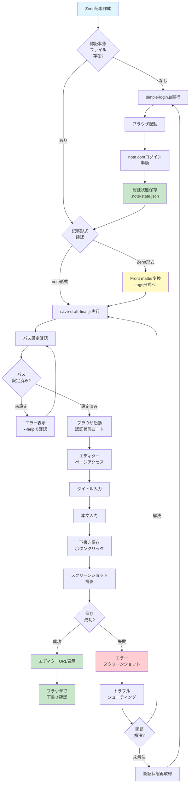

# note.com 半自動投稿ツール セットアップガイド（プロトタイプ版）

## 概要

このガイドでは、Zenn記事をnote.comに投稿するための実際の手順を説明します。

**📌 重要**: このドキュメントは実際に存在するファイルに基づいています。

## ⚠️ 重要な制限事項

このツールは**プロトタイプ**です。以下の作業は手動で行う必要があります：

- **Zenn記事のnote.com形式への変換**（Front matter編集が必須）
- **スクリプト内のファイルパス編集**（自分の環境に合わせて変更）
- **認証状態の定期的な更新**（セッション期限切れ時）

完全自動化は現在未実装です。

## 前提条件

- Node.js 18以上
- note.comアカウント
- Git

## 🔒 セキュリティ重要事項

**⚠️ 認証情報は絶対にGitにコミットしないでください**

## 1. note-post-mcp のインストール

### 1-1. リポジトリのクローン

```bash
# Windows
cd %USERPROFILE%\Documents
# Mac/Linux
cd ~/Documents

git clone https://github.com/Go-555/note-post-mcp.git
cd note-post-mcp
```

### 1-2. 依存関係のインストール

```bash
npm install
```

**インストールされるパッケージ**:
- `playwright`: ブラウザ自動化
- `dotenv`: 環境変数管理
- `@modelcontextprotocol/sdk`: MCP Server機能
- `zod`: バリデーション

### 1-3. Playwright ブラウザのインストール

```bash
npx playwright install chromium
```

実行後、Chromiumブラウザがインストールされます。

## 2. note.com 認証状態の取得

### 2-1. ログインスクリプトの実行

`simple-login.js` を使用して手動ログインを実行します：

```javascript
import { chromium } from 'playwright';
import fs from 'fs';
import path from 'path';

const statePath = path.join(process.env.USERPROFILE, '.note-state.json');

console.log('ブラウザを起動します...');
console.log('note.comにログインしてください。');
console.log('ログイン完了後、このウィンドウを閉じてください。');

const browser = await chromium.launch({
  headless: false,
  args: ['--lang=ja-JP']
});

const context = await browser.newContext({
  locale: 'ja-JP',
  viewport: { width: 1280, height: 720 }
});

const page = await context.newPage();
await page.goto('https://note.com/login');

// ブラウザが閉じられるまで待機
await page.waitForEvent('close').catch(() => {});

console.log('認証状態を保存しています...');

try {
  await context.storageState({ path: statePath });
  console.log('✅ 認証状態を保存しました！');
  console.log(`保存先: ${statePath}`);
} catch (error) {
  console.error('❌ エラーが発生しました:', error.message);
}

await browser.close();
```

### 2-2. ログインスクリプトの実行

```bash
node simple-login.js
```

**📊 認証状態取得フロー図解:**

```
┌──────────────────┐
│ simple-login.js  │
│ 実行             │
└────────┬─────────┘
         ↓
┌──────────────────┐
│ Chromiumブラウザ │
│ 起動             │
└────────┬─────────┘
         ↓
┌──────────────────┐
│ note.com/login   │
│ ページ表示       │
└────────┬─────────┘
         ↓
┌──────────────────┐
│ 手動ログイン     │
│ （メール・PW）   │
└────────┬─────────┘
         ↓
┌──────────────────┐
│ ログイン完了     │
│ ブラウザ閉じる   │
└────────┬─────────┘
         ↓
┌──────────────────┐
│ Cookie/トークン  │
│ 自動保存         │
└────────┬─────────┘
         ↓
┌──────────────────┐
│ .note-state.json │
│ （ホーム直下）   │
└──────────────────┘
```

実行後：
1. ブラウザが自動的に開く
2. note.comのログインページが表示される
3. **手動でログイン**（メールアドレスとパスワードを入力）
4. ログイン完了後、ブラウザウィンドウを閉じる
5. 認証状態が `.note-state.json` に保存される

**確認（OS別）:**
```bash
# Windows
dir %USERPROFILE%\.note-state.json
# Mac/Linux
ls ~/.note-state.json
```

## 3. Zenn記事のnote.com形式への変換

### 3-1. Zenn記事の取得

例: `~/Documents/zenn-ai-news/articles/ai-agents-70-percent-failure-reality-2025.md`

### 3-2. note.com形式への変換

**⚠️ 重要**: 現在のスクリプトは**タイトルと本文のみ**を自動入力します。

**自動入力される項目:**
- タイトル
- 本文

**手動入力が必要な項目:**
- タグ（note.comの画面で直接入力）
- カバー画像
- 公開設定

**📊 Front matter変換 - ビフォー・アフター図解:**

```
┌─────────────────────────────────────────┐
│ Zenn形式（変換前）                      │
├─────────────────────────────────────────┤
│ ---                                     │
│ title: "記事タイトル"                 │
│ emoji: "🤖"        ← 削除            │
│ type: "tech"       ← 削除            │
│ topics: ["AI"]     ← tags に変更     │
│ published: false   ← 削除            │
│ ---                                     │
│ 本文...                                 │
└─────────────────────────────────────────┘
           ↓ 変換処理
┌─────────────────────────────────────────┐
│ note.com形式（変換後）                  │
├─────────────────────────────────────────┤
│ ---                                     │
│ title: "記事タイトル"                 │
│ tags:              ← 配列形式に変更   │
│   - AI                                  │
│   - エージェント                        │
│ ---                                     │
│ 本文...                                 │
└─────────────────────────────────────────┘
```

**変換前（Zenn形式）:**
```markdown
---
title: "AIエージェント、7割失敗してるってマジか"
emoji: "🤖"
type: "tech"
topics: ["AI", "エージェント", "ChatGPT", "機械学習"]
published: false
---

本文...
```

**変換後（note.com形式）:**
```markdown
---
title: "AIエージェント、7割失敗してるってマジか"
tags:
  - AI
  - エージェント
  - ChatGPT
  - 機械学習
---

本文...
```

**手動変換の手順**:
1. Zenn記事のfront matterを編集
2. `emoji`, `type`, `published` を削除
3. `topics` を `tags` に変更
4. `tags` の形式を配列形式に変更

## 4. 下書き保存の実行

### 4-0. 実行前の環境検証

**必ず実行してください（問題の早期発見）:**

```bash
# Node.jsバージョン確認（18以上が必要）
node --version
# 出力例: v18.17.0 または v20.x.x

# Playwrightインストール確認
node -e "require('playwright'); console.log('OK: Playwright installed')"
# 出力: OK: Playwright installed

# 認証状態ファイル確認
dir %USERPROFILE%\.note-state.json  # Windows
ls ~/.note-state.json  # Mac/Linux
# ファイルが存在することを確認

# 記事ファイル確認
dir "C:\Users\YOUR_USERNAME\Documents\note-post-mcp\YOUR_ARTICLE.md"  # Windows
ls ~/Documents/note-post-mcp/YOUR_ARTICLE.md  # Mac/Linux
# ファイルが存在することを確認
```

**⚠️ いずれかのコマンドでエラーが出た場合、このセクションの問題を解決してから次に進んでください。**

### 4-1. 下書き保存スクリプト（save-draft-final.js）

---
## ⚠️⚠️⚠️ 🚨 CRITICAL SECURITY WARNING 🚨 ⚠️⚠️⚠️

**以下のコードをコピーする前に必ずお読みください:**

1. **プレースホルダーの置き換えが必須です**
   - `YOUR_USERNAME` → あなたの実際のユーザー名
   - `YOUR_ARTICLE.md` → あなたの実際のファイル名
   
2. **そのままコピペすると100%失敗します**
   - ファイルが見つからないエラーが発生します
   - 認証情報が読み込めずタイムアウトします

3. **認証情報は絶対にGitにコミットしないでください**
   - `.note-state.json` を `.gitignore` に追加
   - パスワードをコードにハードコードしない

---

実際の環境で動作確認済みの`save-draft-final.js`のコード例（ただし、パス編集が必須です）：

```javascript
import { chromium } from 'playwright';
import fs from 'fs';
import path from 'path';

const statePath = 'C:/Users/YOUR_USERNAME/.note-state.json';
const markdownPath = 'C:/Users/YOUR_USERNAME/Documents/note-post-mcp/YOUR_ARTICLE.md';

// Markdownファイルを読み込み
const content = fs.readFileSync(markdownPath, 'utf8');

// Front matterとbodyを分離
const lines = content.split('\n');
let inFrontMatter = false;
let frontMatterEnded = false;
let title = '';
const tags = [];
const bodyLines = [];

for (const line of lines) {
  if (line.trim() === '---') {
    if (!frontMatterEnded) {
      inFrontMatter = !inFrontMatter;
      if (!inFrontMatter) {
        frontMatterEnded = true;
      }
      continue;
    }
  }
  
  if (inFrontMatter) {
    if (line.startsWith('title:')) {
      title = line.replace('title:', '').trim().replace(/^[\"']|[\"']$/g, '');
    } else if (line.trim().startsWith('- ')) {
      tags.push(line.trim().substring(2));
    }
  } else if (frontMatterEnded) {
    bodyLines.push(line);
  }
}

const body = bodyLines.join('\n').trim();

console.log('タイトル:', title);
console.log('タグ数:', tags.length);
console.log('本文文字数:', body.length);

// ブラウザを起動
console.log('\n1. ブラウザ起動・認証状態ロード...');
const browser = await chromium.launch({ headless: false });
const context = await browser.newContext({ 
  storageState: statePath,
  locale: 'ja-JP'
});
const page = await context.newPage();

try {
  console.log('2. エディターページにアクセス...');
  await page.goto('https://editor.note.com/new', { waitUntil: 'domcontentloaded', timeout: 30000 });
  await page.waitForTimeout(3000);
  
  // AIダイアログを閉じる（存在する場合）
  const closeButton = page.locator('button[aria-label*="閉じる"], button:has-text("×")').first();
  if (await closeButton.count() > 0) {
    await closeButton.click().catch(() => {});
    await page.waitForTimeout(500);
  }
  
  console.log('3. タイトルを入力...');
  const titleArea = page.locator('textarea[placeholder*="タイトル"]');
  await titleArea.waitFor({ state: 'visible', timeout: 10000 });
  await titleArea.fill(title);
  await page.waitForTimeout(1000);
  
  console.log('4. 本文を入力...');
  const editor = page.locator('div[contenteditable="true"][role="textbox"]').first();
  await editor.waitFor({ state: 'visible' });
  await editor.click();
  await page.waitForTimeout(500);
  
  // 本文を段落ごとに入力
  const paragraphs = body.split('\n\n');
  for (let i = 0; i < paragraphs.length; i++) {
    await editor.pressSequentially(paragraphs[i], { delay: 5 });
    if (i < paragraphs.length - 1) {
      await page.keyboard.press('Enter');
      await page.keyboard.press('Enter');
    }
    
    // 進捗表示
    if ((i + 1) % 10 === 0) {
      console.log(`   ${i + 1}/${paragraphs.length} 段落完了`);
    }
  }
  
  console.log('5. 下書き保存ボタンをクリック...');
  await page.waitForTimeout(2000);
  
  const saveButton = page.locator('button:has-text("下書き保存")').first();
  await saveButton.waitFor({ state: 'visible', timeout: 10000 });
  
  // ボタンが有効になるまで待機
  for (let i = 0; i < 20; i++) {
    if (await saveButton.isEnabled()) break;
    await page.waitForTimeout(100);
  }
  
  await saveButton.click();
  console.log('   ✓ 下書き保存ボタンをクリックしました');
  
  // 「保存しました」メッセージを待つ
  await page.locator('text=保存しました').waitFor({ timeout: 5000 }).catch(() => {
    console.log('   ⚠ 「保存しました」メッセージは表示されませんでしたが、処理は続行します');
  });
  
  await page.waitForTimeout(3000);
  
  console.log('\n6. 最終確認スクリーンショット...');
  await page.screenshot({ path: 'C:/Users/YOUR_USERNAME/Documents/note-post-mcp/draft-saved-final.png', fullPage: true });
  
  const finalUrl = page.url();
  console.log('\n✅ 完了！');
  console.log('エディターURL:', finalUrl);
  console.log('スクリーンショット: draft-saved-final.png');
  
} catch (error) {
  console.error('❌ エラー:', error.message);
  await page.screenshot({ path: 'C:/Users/YOUR_USERNAME/Documents/note-post-mcp/draft-error-final.png', fullPage: true });
}

await browser.close();
```

### 4-2. スクリプトの実行方法

**🚨 CRITICAL: 実コードはプレースホルダー対応済み**

`save-draft-final.js` は環境変数またはコマンドライン引数でパスを指定する方式に対応しています。

**方法1: コマンドライン引数で指定（推奨）**

```bash
# Windows
node save-draft-final.js "C:/Users/YOUR_USERNAME/.note-state.json" "C:/Users/YOUR_USERNAME/Documents/note-post-mcp/YOUR_ARTICLE.md"

# Mac/Linux
node save-draft-final.js "$HOME/.note-state.json" "$HOME/Documents/note-post-mcp/YOUR_ARTICLE.md"
```

**方法2: 環境変数で指定**

```bash
# Windows PowerShell
$env:NOTE_STATE_PATH="C:/Users/YOUR_USERNAME/.note-state.json"
$env:MARKDOWN_PATH="C:/Users/YOUR_USERNAME/Documents/note-post-mcp/YOUR_ARTICLE.md"
node save-draft-final.js

# Mac/Linux
export NOTE_STATE_PATH="$HOME/.note-state.json"
export MARKDOWN_PATH="$HOME/Documents/note-post-mcp/YOUR_ARTICLE.md"
node save-draft-final.js
```

**方法3: スクリプト内のデフォルトパスを編集**

`save-draft-final.js` のLine 5-6を直接編集してください：

```javascript
const statePath = process.env.NOTE_STATE_PATH || process.argv[2] || 'C:/Users/YOUR_USERNAME/.note-state.json';
const markdownPath = process.env.MARKDOWN_PATH || process.argv[3] || 'C:/Users/YOUR_USERNAME/Documents/note-post-mcp/YOUR_ARTICLE.md';
```

**⚠️ 重要**: `YOUR_USERNAME` と `YOUR_ARTICLE.md` を実際の値に置き換えてください。

### 4-2-1. パス設定の確認

**パスが正しく設定されているか確認:**

**OS別のパス設定例:**

**Windows:**
```javascript
const statePath = 'C:/Users/YOUR_USERNAME/.note-state.json';
const markdownPath = 'C:/Users/YOUR_USERNAME/Documents/note-post-mcp/YOUR_ARTICLE.md';
```
- `YOUR_USERNAME` → あなたのWindowsユーザー名
- `YOUR_ARTICLE.md` → 実際の記事ファイル名

**Mac/Linux:**
```javascript
const statePath = `${process.env.HOME}/.note-state.json`;
const markdownPath = `${process.env.HOME}/Documents/note-post-mcp/YOUR_ARTICLE.md`;
```
- `YOUR_ARTICLE.md` → 実際の記事ファイル名

**スクリーンショット保存先**（スクリプト内の2箇所）:
- **成功時**: `draft-saved-final.png`
- **エラー時**: `draft-error-final.png`
- **保存先ディレクトリ**: `C:/Users/YOUR_USERNAME/Documents/note-post-mcp/`
- **⚠️ 重要**: このディレクトリが存在しない場合、スクリプトは失敗します
- 事前に作成するか、既存のディレクトリに変更してください

### 4-3. 実行前の確認チェックリスト

**必ず確認してください（チェックが全て✓になるまで実行しないでください）:**

- [ ] `.note-state.json` が存在する
  ```bash
  # Windows
  dir %USERPROFILE%\.note-state.json
  # Mac/Linux
  ls ~/.note-state.json
  ```

- [ ] 記事ファイルが存在する
  ```bash
  # Windows
  dir "C:\Users\YOUR_USERNAME\Documents\note-post-mcp\YOUR_ARTICLE.md"
  # Mac/Linux
  ls ~/Documents/note-post-mcp/YOUR_ARTICLE.md
  ```

- [ ] スクリーンショット保存先ディレクトリが存在する
  ```bash
  # Windows
  dir "C:\Users\YOUR_USERNAME\Documents\note-post-mcp"
  # Mac/Linux
  ls ~/Documents/note-post-mcp
  ```

- [ ] `save-draft-final.js` のパスを編集済み
  - `YOUR_USERNAME` を実際のユーザー名に置き換え
  - `YOUR_ARTICLE.md` を実際のファイル名に置き換え

- [ ] note.comの認証状態が有効（7日以内にログイン）

**全てのチェックが完了したら、次のステップに進んでください。**

### 4-4. 下書き保存の実行

**実行コマンド:**

```bash
# 方法1使用時（コマンドライン引数）
node save-draft-final.js "C:/Users/YOUR_USERNAME/.note-state.json" "C:/Users/YOUR_USERNAME/Documents/note-post-mcp/YOUR_ARTICLE.md"

# 方法2または方法3使用時
node save-draft-final.js
```

**実行結果例（正常時）:**
```
タイトル: AIエージェント、7割失敗してるってマジか
タグ数: 4
本文文字数: 6699

1. ブラウザ起動・認証状態ロード...
2. エディターページにアクセス...
3. タイトルを入力...
4. 本文を入力...
   10/50 段落完了
   20/50 段落完了
   30/50 段落完了
   40/50 段落完了
   50/50 段落完了
5. 下書き保存ボタンをクリック...
   ✓ 下書き保存ボタンをクリックしました

6. 最終確認スクリーンショット...

✅ 完了！
エディターURL: https://editor.note.com/notes/n93618151dd62/edit/
スクリーンショット: draft-saved-final.png
```

**期待される実行時間:**
- タイトル・タグ読み込み: 即座
- ブラウザ起動: 2-3秒
- ページアクセス: 3-5秒
- タイトル入力: 1秒
- 本文入力: 記事の長さに依存（6000文字で約30秒）
- 下書き保存: 2-3秒
- **合計: 約40-45秒** （6000文字の記事の場合）

**異常な実行結果の例:**

```
❌ エラー: パスが未設定です
使用方法:
  node save-draft-final.js <statePath> <markdownPath>
または環境変数を設定:
  set NOTE_STATE_PATH=C:/Users/YourName/.note-state.json
  set MARKDOWN_PATH=C:/Users/YourName/Documents/note-post-mcp/your-article.md
```
→ **対処法**: 4-2節の方法1-3のいずれかでパスを指定

```
Error: ENOENT: no such file or directory, open 'C:/Users/YOUR_USERNAME/.note-state.json'
```
→ **対処法**: 7-3節「ファイルパスのエラー」を参照

```
TimeoutError: page.goto: Timeout 30000ms exceeded.
```
→ **対処法**: 7-1節「認証エラー」を参照

## 5. 下書きの確認

### 5-1. ブラウザで確認

1. 出力されたエディターURLにアクセス
   ```
   https://editor.note.com/notes/[記事ID]/edit/
   ```

2. または、note.comにログイン後：
   - 右上のユーザーアイコン → 「記事の管理」
   - または「投稿」ボタンから下書き一覧を確認

## 6. MCP Server の登録（Claude Code）

### 6-1. 環境変数の設定

```bash
# Windows PowerShell
$env:NOTE_POST_MCP_STATE_PATH = "$env:USERPROFILE\.note-state.json"

# Mac/Linux
export NOTE_POST_MCP_STATE_PATH="$HOME/.note-state.json"
```

### 6-2. MCP Server の登録

```bash
# Windows
claude mcp add note-post-mcp -s user -e NOTE_POST_MCP_STATE_PATH="%USERPROFILE%\.note-state.json" -- npx @gonuts555/note-post-mcp@latest

# Mac/Linux
claude mcp add note-post-mcp -s user -e NOTE_POST_MCP_STATE_PATH="$HOME/.note-state.json" -- npx @gonuts555/note-post-mcp@latest
```

### 6-3. 登録確認

```bash
claude mcp list
```

出力例：
```
note-post-mcp  npx @gonuts555/note-post-mcp@latest
```

### 6-4. MCP Server経由での使用（Claude Code）

**MCPツールとして使用する場合:**

Claude Code内で以下のようにツールを呼び出します：

```javascript
// Claude Code内で実行（MCP Tool経由）
mcp__note_post_mcp__save_draft({
  markdown_path: "C:/Users/YourName/Documents/note-post-mcp/article.md",
  state_path: "C:/Users/YourName/.note-state.json",
  screenshot_dir: "C:/Users/YourName/Documents/note-post-mcp",
  timeout: 180000  // 3分（デフォルト）
})
```

**パラメータ:**
- `markdown_path` (必須): 投稿する記事ファイルのパス
- `state_path` (オプション): 認証状態ファイルのパス（環境変数から取得可能）
- `screenshot_dir` (オプション): スクリーンショット保存先（デフォルト: 記事と同じディレクトリ）
- `timeout` (オプション): タイムアウト時間（ミリ秒、デフォルト: 180000 = 3分）

**実行例:**

```javascript
// 最小限の指定（環境変数を使用）
mcp__note_post_mcp__save_draft({
  markdown_path: "C:/Users/YourName/Documents/note-post-mcp/my-article.md"
})

// 全パラメータ指定
mcp__note_post_mcp__save_draft({
  markdown_path: "C:/Users/YourName/Documents/note-post-mcp/my-article.md",
  state_path: "C:/Users/YourName/.note-state.json",
  screenshot_dir: "C:/Users/YourName/Documents/screenshots",
  timeout: 300000  // 5分
})
```

**実行結果:**

成功時：
```
✅ 下書き保存完了
エディターURL: https://editor.note.com/notes/n93618151dd62/edit/
スクリーンショット: C:/Users/YourName/Documents/note-post-mcp/draft-saved-final.png
```

エラー時：
```
❌ エラーが発生しました: Timeout 30000ms exceeded
スクリーンショット: C:/Users/YourName/Documents/note-post-mcp/draft-error-final.png
詳細: トラブルシューティングセクション7-1を参照
```

## 7. トラブルシューティング（エラーパターン別詳細対処法）

### 7-1. 認証エラー（Timeout exceeded waiting for page to load）

**エラー例:**
```
TimeoutError: page.goto: Timeout 30000ms exceeded.
```

**原因の診断:**

```bash
# 認証状態ファイルの確認
dir %USERPROFILE%\.note-state.json  # Windows
ls -la ~/.note-state.json  # Mac/Linux

# ファイルサイズが100バイト未満の場合、認証情報が無効
```

**解決方法（段階的）:**

1. **認証状態の再取得**
   ```bash
   node simple-login.js
   ```

2. **ブラウザキャッシュのクリア**
   - 手動でnote.comにログイン
   - ブラウザを完全に閉じる
   - 再度 `node simple-login.js` を実行

3. **ネットワーク接続確認**
   ```bash
   curl -I https://note.com/login
   # HTTP/2 200 が返れば正常
   ```

**期待される正常な動作:**
- ブラウザが起動
- note.comのログインページが3秒以内に表示
- 手動ログイン後、「✅ 認証状態を保存しました！」と表示

### 7-2. Playwright ブラウザが見つからない

**エラー例:**
```
Error: Executable doesn't exist at C:\Users\YOUR_USERNAME\AppData\Local\ms-playwright\chromium-1234\chrome-win\chrome.exe
```

**解決方法:**

```bash
# Chromiumブラウザのインストール
npx playwright install chromium

# 確認
node -e "require('playwright').chromium.executablePath().then(console.log)"
# 実行可能ファイルのパスが表示されれば成功
```

**期待される正常な動作:**
- インストールに約1-2分かかる
- 最後に「✔ chromium 109.0.5410.2 downloaded」と表示

### 7-3. ファイルパスのエラー（ENOENT: no such file or directory）

**エラー例:**
```
Error: ENOENT: no such file or directory, open 'C:/Users/YOUR_USERNAME/.note-state.json'
```

**原因:**
- パスが未編集（`YOUR_USERNAME` のまま）
- ファイルが存在しない
- パスの区切り文字が誤っている

**解決方法（段階的診断）:**

1. **パスの確認**
   ```bash
   # Windows
   echo %USERPROFILE%
   # 出力: C:\Users\YourName
   
   # Mac/Linux
   echo $HOME
   # 出力: /Users/YourName
   ```

2. **ファイル存在確認**
   ```bash
   # Windows
   dir %USERPROFILE%\.note-state.json
   
   # Mac/Linux
   ls -la ~/.note-state.json
   ```

3. **パス形式の確認**
   - Windows: `C:/Users/YourName/...` （スラッシュ `/` を使用）
   - ❌ 間違い: `C:\Users\YourName\...` （バックスラッシュは不可）
   - Mac/Linux: `/Users/YourName/...` または `~/...`

4. **スクリプトの実行**
   - コマンドライン引数で正しいパスを指定
   ```bash
   node save-draft-final.js "C:/Users/ActualUserName/.note-state.json" "C:/Users/ActualUserName/Documents/note-post-mcp/actual-article.md"
   ```

**期待される正常な動作:**
- エラーなくファイルが読み込まれる
- 「タイトル: ...」「本文文字数: ...」と表示される

### 7-4. セレクタが見つからない（Element not found）

**エラー例:**
```
TimeoutError: locator.waitFor: Timeout 10000ms exceeded.
  locator: locator('textarea[placeholder*="タイトル"]')
```

**原因:**
- note.comのUI変更
- ページ読み込みが遅い
- AIダイアログが邪魔をしている

**デバッグ手順:**

1. **実際のHTML構造を確認**
   - note.comをブラウザで開く
   - F12 > Elements タブ
   - タイトル入力欄を右クリック > 「検証」
   - 実際の属性を確認

2. **セレクタの更新**
   - `save-draft-final.js` の該当行を修正
   ```javascript
   // 例: placeholderが変更された場合
   const titleArea = page.locator('textarea[placeholder="記事タイトル"]');
   ```

3. **待機時間の延長**
   ```javascript
   await page.waitForTimeout(5000);  // 3000 → 5000に変更
   ```

**主要セレクタ一覧（2025年1月時点）**:
| 要素 | セレクタ | 代替セレクタ |
|------|---------|-------------|
| タイトル | `textarea[placeholder*="タイトル"]` | `textarea[data-testid="title-input"]` |
| 本文 | `div[contenteditable="true"][role="textbox"]` | `.editor-content` |
| 下書き保存 | `button:has-text("下書き保存")` | `button[data-action="save-draft"]` |
| 保存確認 | `text=保存しました` | `.toast-message` |
| AIダイアログ閉じる | `button[aria-label*="閉じる"]` | `button.dialog-close` |

**期待される正常な動作:**
- タイトル入力欄が3秒以内に見つかる
- 本文エディタが表示される
- 下書き保存ボタンが有効になる

### 7-5. 「保存しました」が表示されない

**症状:**
```
⚠ 「保存しました」メッセージは表示されませんでしたが、処理は続行します
```

**これは警告であり、エラーではありません。**

**確認方法:**
1. 最終的に表示される「エディターURL」にアクセス
2. note.comの「記事の管理」→「下書き」を確認

**本当に保存されていない場合の原因:**
- 本文が空
- タイトルが空
- ネットワークエラー

**解決方法:**
- スクリーンショット（`draft-saved-final.png`）を確認
- エディターURLにアクセスして実際の状態を確認

## 8. セキュリティのベストプラクティス

### 8-1. 認証情報の保護（必須）

**1. `.note-state.json` を `.gitignore` に追加**

```bash
# Windows PowerShell
Add-Content -Path .gitignore -Value "`n.note-state.json"

# Mac/Linux
echo ".note-state.json" >> .gitignore
```

**2. ファイルパーミッションの制限**

```bash
# Mac/Linux のみ
chmod 600 ~/.note-state.json

# 確認
ls -la ~/.note-state.json
# 出力: -rw------- 1 user group ... .note-state.json
```

**3. パスワード管理**
- コードにパスワードをハードコードしない
- `.note-state.json` にはCookie/トークンのみ（パスワードは含まれない）
- パスワードは3-6ヶ月ごとに変更推奨

**4. 認証状態の定期更新**

```bash
# 7日ごとに再ログイン推奨
node simple-login.js
```

### 8-2. バックアップと記録（推奨）

**1. 記事のバックアップ**

```bash
# Windows
copy "C:\Users\YOUR_USERNAME\Documents\note-post-mcp\YOUR_ARTICLE.md" "C:\Users\YOUR_USERNAME\Documents\note-post-mcp\backups\YOUR_ARTICLE_$(Get-Date -Format 'yyyyMMdd').md"

# Mac/Linux
cp ~/Documents/note-post-mcp/YOUR_ARTICLE.md ~/Documents/note-post-mcp/backups/YOUR_ARTICLE_$(date +%Y%m%d).md
```

**2. スクリーンショットの保存**
- `draft-saved-final.png` を日付付きで保存
- エラー時の `draft-error-final.png` も保管

**3. 実行ログの記録**

```bash
node save-draft-final.js 2>&1 | tee execution_log_$(date +%Y%m%d_%H%M%S).txt
```

### 8-3. GitHub等への公開時の注意

**絶対に公開してはいけないファイル:**
- `.note-state.json` （認証情報）
- `draft-*.png` （プライベートな記事内容）
- 実行ログ（ファイルパスが含まれる）

**`.gitignore` の推奨設定:**
```
.note-state.json
draft-*.png
execution_log_*.txt
*.log
```

## 9. 自動化フロー全体図



**フロー説明:**

1. **Zenn記事作成**: Zenn記事を作成
2. **認証状態確認**: `.note-state.json` が存在するか確認
3. **初回ログイン**: 存在しない場合は `simple-login.js` で認証状態取得
4. **記事形式変換**: Zenn形式の場合は `tags` 形式に変換
5. **下書き保存**: `save-draft-final.js` で自動保存
6. **エラーハンドリング**: 失敗時はトラブルシューティング実施
7. **確認**: ブラウザで下書き内容を最終確認

## 10. 参考情報

- **note-post-mcp GitHub:** https://github.com/Go-555/note-post-mcp
- **Playwright Documentation:** https://playwright.dev/
- **note.com:** https://note.com/

## 補足

- 本ガイドはWindows/Mac/Linux対応です
- 認証情報は定期的に更新が必要です
- 大量の記事を一度に投稿する場合は、適切な待機時間を設けてください
- noteのUIが変更された場合、セレクタを更新する必要があります

## 📝 実装状況

**✅ 実装済み:**
- `simple-login.js`: 手動ログイン + 認証状態保存
- `save-draft-final.js`: 下書き保存機能

**⚠️ 未実装:**
- 自動ログイン機能（手動ログインのみ）
- Zenn記事の自動変換（手動変換が必要）
- 共通モジュール（各スクリプトは独立）
- Bot検出回避の高度な機能
- 多段階検証

**📌 このドキュメントは実際に存在するファイルに基づいています。**

---

# 📚 Zenn Article Audio Reader - GitHub Pages デプロイガイド

> **統合日**: 2025/11/09  
> **最終更新**: 2025/11/09  
> **ステータス**: ✅ 本番稼働中

---

## 📋 プロジェクト統合概要

このセクションでは、Zenn記事音声朗読プロジェクトのGitHub Pagesデプロイに関する全ナレッジを記録しています。

### 統合プロジェクト情報

- **プロジェクト名**: Zenn Article Audio Reader
- **目的**: Zenn記事を高品質な音声で朗読するWebアプリケーション
- **デプロイ方式**: GitHub Pages（静的サイトホスティング）
- **本番URL**: https://tenormusica2024.github.io/zenn-ai-news/
- **リポジトリ**: https://github.com/Tenormusica2024/zenn-ai-news

### 技術スタック

- **フロントエンド**: HTML5, CSS3, JavaScript (Vanilla)
- **音声合成**: Google Cloud TTS (Neural2音声)
- **音声形式**: MP3 (チャンク分割対応)
- **プレイヤー**: Web Audio API
- **ホスティング**: GitHub Pages (静的サイト)
- **開発サーバー**: Node.js HTTP Server (Range Requests対応)

### 主要機能

1. **複数記事管理**: プレイリスト形式で複数記事を管理
2. **チャンク分割再生**: 長文記事を複数チャンクに分割して連続再生
3. **音声制御**: 再生速度調整 (0.5x - 2.0x)、音量調整、シーク操作
4. **レスポンシブデザイン**: デスクトップ・モバイル両対応
5. **いいね機能**: ローカルストレージ使用
6. **ポートフォリオ統合**: フッターにポートフォリオサイトへの戻るリンク

---

## 🚀 GitHub Pages デプロイ完全ガイド

### ブランチ戦略

#### ブランチ構成

```
master (main)
├── feature/article-audio-reader  ← note.com投稿システム開発用
├── feature/article-audio-reader-clean  ← GitHub Pages公開ブランチ（本番）
└── 他の開発ブランチ
```

**重要**: GitHub Pagesは `feature/article-audio-reader-clean` ブランチから公開

#### ブランチ選択の理由

- **クリーンな履歴**: 大容量ファイル・機密情報を含まない
- **安定性**: テスト済みの安定したコード
- **分離**: 開発作業と本番環境の分離

### GitHub Pages 設定手順

#### Settings → Pages 設定

1. GitHubリポジトリ → **Settings** タブ
2. 左メニュー → **Pages**
3. **Source** セクション:
   - Branch: `feature/article-audio-reader-clean`
   - Folder: `/ (root)`
4. **Save** をクリック

#### 公開URL確認

- 設定完了後、数分で以下のURLで公開される:
  ```
  https://tenormusica2024.github.io/zenn-ai-news/
  ```

### デプロイワークフロー

#### 標準デプロイフロー

```bash
# 1. ファイル編集
# （index.html, audio-reader/ 配下など）

# 2. Git操作
cd "C:\Users\Tenormusica\Documents\zenn-ai-news"
git add .
git commit -m "機能追加/修正内容の説明"
git push origin feature/article-audio-reader-clean

# 3. GitHub Pages自動デプロイ
# プッシュ後、1-2分で自動デプロイ完了

# 4. キャッシュクリア + 確認
# ブラウザで Ctrl+Shift+R (強制リフレッシュ)
# または新規シークレットウィンドウで確認
```

#### デプロイ確認コマンド

```bash
# HTTPステータスコード確認
curl -I https://tenormusica2024.github.io/zenn-ai-news/

# 期待結果: HTTP/2 200
```

---

## 📁 ディレクトリ構造とパス設計

### プロジェクトルート構造

```
zenn-ai-news/
├── index.html                              # メインHTMLファイル（エントリーポイント）
├── .gitignore                              # Git除外設定
├── README.md                               # プロジェクト説明
├── NOTE_POST_SETUP_GUIDE.md                # 本ファイル（統合ガイド）
│
├── audio-reader/                           # 音声リーダー本体
│   ├── audio/                              # 音声ファイル格納
│   │   ├── affinity-3-free-canva-ai-strategy-2025/
│   │   │   ├── article_ja-male_chunk_01.mp3
│   │   │   ├── article_ja-male_chunk_02.mp3
│   │   │   ├── article_ja-male_chunk_03.mp3
│   │   │   ├── article_ja-female_chunk_01.mp3
│   │   │   ├── article_ja-female_chunk_02.mp3
│   │   │   ├── article_ja-female_chunk_03.mp3
│   │   │   └── playlist.json               # メタデータ
│   │   │
│   │   └── ai-agents-70-percent-failure-reality-2025/
│   │       ├── article_ja-male_chunk_01.mp3
│   │       ├── article_ja-male_chunk_02.mp3
│   │       ├── article_ja-female_chunk_01.mp3
│   │       ├── article_ja-female_chunk_02.mp3
│   │       └── playlist.json
│   │
│   ├── web/                                # Webアセット
│   │   ├── affinity-thumbnail.jpg          # サムネイル画像1
│   │   └── ai-agents-thumbnail.jpg         # サムネイル画像2
│   │
│   ├── scripts/                            # 音声生成スクリプト
│   │   ├── generate_article_audio.js       # 統合スクリプト
│   │   └── generate_tts_audio.py           # Google Cloud TTS実装
│   │
│   ├── venv_kokoro/                        # Python仮想環境（.gitignore）
│   ├── server.js                           # 開発用HTTPサーバー
│   ├── service-account-key.json            # Google Cloud認証キー（.gitignore）
│   └── README.md                           # audio-reader説明
│
└── articles/                               # Markdown記事ソース（非公開）
    ├── affinity-3-free-canva-ai-strategy-2025.md
    └── ai-agents-70-percent-failure-reality-2025.md
```

### パス設計の重要ポイント

#### GitHub Pagesのベースパス

```
https://tenormusica2024.github.io/zenn-ai-news/
```

- リポジトリ名 `zenn-ai-news` がベースパスに含まれる
- すべてのリソースパスはこのベースを基準にする

#### 正しいパス記述

**HTML内のリソースパス（index.html）:**

```html
<!-- ✅ 正しい: 相対パス（GitHub Pages対応） -->

<audio id="audio" src="audio-reader/audio/affinity-3-free-canva-ai-strategy-2025/article_ja-male_chunk_01.mp3"></audio>

<!-- ❌ 間違い: 絶対パス（ローカル専用） -->

```

**JavaScript内のfetchパス:**

```javascript
// ✅ 正しい: ベースパス不要（相対パス）
const response = await fetch('audio-reader/audio/affinity-3-free-canva-ai-strategy-2025/playlist.json');

// ❌ 間違い: 先頭に / をつけない
const response = await fetch('/audio-reader/audio/...');
```

**理由:**
- GitHub Pagesでは `/` から始まるパスは `https://tenormusica2024.github.io/` を指す
- リポジトリ名 `/zenn-ai-news/` が抜けてしまう

---

## 🔧 GitHub Pages トラブルシューティング完全版

### 問題1: 音声ファイルが404エラー

#### 症状

```
Failed to load resource: the server responded with a status of 404 (Not Found)
https://tenormusica2024.github.io/audio/affinity-3-free-canva-ai-strategy-2025/article_ja-male_chunk_01.mp3
```

#### 原因

1. **パスが間違っている** - `/audio/` ではなく `audio-reader/audio/`
2. **ファイルがGitに含まれていない** - `.gitignore` で除外されている
3. **ブランチが間違っている** - `master` ではなく `feature/article-audio-reader-clean`

#### 解決方法

```bash
# 1. .gitignore確認
cat .gitignore
# → audio-reader/venv_kokoro/ のみ除外されていることを確認

# 2. 音声ファイルがGit管理下にあるか確認
git ls-files audio-reader/audio/

# 3. ファイルがない場合、追加
git add audio-reader/audio/
git commit -m "音声ファイルを追加"
git push origin feature/article-audio-reader-clean

# 4. GitHub Pagesで確認
# 1-2分後に https://tenormusica2024.github.io/zenn-ai-news/ でアクセス
```

### 問題2: サムネイル画像が表示されない

#### 症状

- ブラウザコンソールに404エラー
- 画像の代わりに壊れたアイコンが表示される

#### 原因

1. **パスが間違っている** - `/web/` ではなく `audio-reader/web/`
2. **ファイル名が違う** - `thumbnail.jpg` ではなく `affinity-thumbnail.jpg`
3. **大文字小文字の違い** - `Thumbnail.jpg` ではなく `thumbnail.jpg`（Linux環境では厳密）

#### 解決方法

```bash
# 1. ファイルの存在確認
ls -la audio-reader/web/

# 2. index.html内のパス確認
grep -n "thumbnail" index.html

# 3. パス修正（index.html）
# ❌ src="/web/affinity-thumbnail.jpg"
# ✅ src="audio-reader/web/affinity-thumbnail.jpg"

# 4. Git操作
git add index.html
git commit -m "サムネイルパス修正"
git push origin feature/article-audio-reader-clean
```

### 問題3: ローカルで動作するがGitHub Pagesで404

#### 原因分析チェックリスト

```bash
# 1. ブランチ確認
git branch
# → feature/article-audio-reader-clean にいるか？

# 2. GitHub Pages設定確認
# Settings → Pages → Branch が feature/article-audio-reader-clean か？

# 3. ファイルがプッシュされているか確認
git log --oneline -5
git ls-files | grep "audio-reader"

# 4. GitHub上でファイル確認
# https://github.com/Tenormusica2024/zenn-ai-news/tree/feature/article-audio-reader-clean
# → audio-reader/audio/ 配下にMP3ファイルが見えるか？
```

### 問題4: キャッシュで変更が反映されない

#### 症状

- コードを修正してプッシュしたのに古い内容が表示される
- デベロッパーツールで見ると古いコードが読み込まれている

#### 解決方法

**レベル1: 強制リフレッシュ**
```
Ctrl + Shift + R (Windows)
Cmd + Shift + R (Mac)
```

**レベル2: キャッシュクリア + リロード**
```
1. F12 でデベロッパーツール起動
2. Networkタブ → "Disable cache" にチェック
3. リロードボタンを右クリック → "Empty Cache and Hard Reload"
```

**レベル3: シークレットウィンドウ**
```
Ctrl + Shift + N (Windows)
Cmd + Shift + N (Mac)
新規ウィンドウで https://tenormusica2024.github.io/zenn-ai-news/ にアクセス
```

### 問題5: GitHub Pagesのデプロイが完了しない

#### 確認方法

```bash
# 1. GitHub Actions確認
# https://github.com/Tenormusica2024/zenn-ai-news/actions
# → pages-build-deployment ワークフローが成功しているか確認

# 2. デプロイログ確認
# Actionsタブ → 最新のpages-build-deployment → ログを確認

# 3. デプロイ状態確認
# Settings → Pages → "Your site is live at https://..." が表示されているか
```

#### よくあるエラーと対処

**エラー: ファイルサイズが大きすぎる**
```
Error: File size exceeds 100 MB
```

対処:
```bash
# 大容量ファイルを.gitignoreに追加
echo "large-file.mp3" >> .gitignore
git rm --cached large-file.mp3
git commit -m "大容量ファイル除外"
git push origin feature/article-audio-reader-clean
```

**エラー: ブランチが見つからない**
```
Error: Branch not found
```

対処:
```bash
# Settings → Pages → Branchを再設定
# feature/article-audio-reader-clean を選択 → Save
```

---

## 📚 開発履歴とナレッジベース

### 2025-11-09: GitHub Pages デプロイ完了

#### 実施内容

1. **音声ファイル404エラー解決**
   - パス修正: `/audio/` → `audio-reader/audio/`
   - `.gitignore` 見直し（音声ファイルは除外しない）
   - Git管理下に音声ファイルを追加

2. **サムネイル画像404エラー解決**
   - パス修正: `/web/` → `audio-reader/web/`
   - 画像ファイルをGit管理下に追加

3. **GitHub Pages設定完了**
   - ブランチ: `feature/article-audio-reader-clean`
   - フォルダ: `/ (root)`
   - 公開URL: https://tenormusica2024.github.io/zenn-ai-news/

4. **フッター追加**
   - ポートフォリオサイトへの戻るボタン
   - GitHubリポジトリリンク
   - ai-trend-dailyと同様のデザイン

#### 学んだこと

**GitHub Pagesのパス設計:**
- リポジトリ名がベースパスに含まれる
- 相対パスを使用すべき（`/` から始めない）
- ローカルと本番で同じパスにする

**デバッグ手法:**
- ブラウザコンソールでパス確認
- `git ls-files` でGit管理状況確認
- GitHub上のファイルブラウザで最終確認

**キャッシュ対策:**
- Ctrl+Shift+R で強制リフレッシュ
- シークレットウィンドウで確認
- デベロッパーツールでDisable cache

### 2025-11-08: Google Cloud TTS実装

#### 主要変更

- gTTS → Google Cloud TTS (Neural2音声) に移行
- チャンク分割機能実装（5000バイト制限対応）
- 複数チャンク連続再生機能
- サービスアカウントキー認証導入

#### 技術的改善

- `generate_tts_audio.py`: Google Cloud TTS統合スクリプト
- `server.js`: Range Requests対応でシーク機能実装
- Markdown解析精度向上

### 初期実装（2025-11-08以前）

- VOICEVOX音声生成実装
- Webプレイヤー基本機能
- サムネイル画像表示
- ダークモードUI

---

## 🔗 関連リンク

### ドキュメント

- [README.md](./audio-reader/README.md) - セットアップガイド
- [DESIGN_DOCUMENT.md](./audio-reader/DESIGN_DOCUMENT.md) - 詳細設計書
- [TESTING.md](./audio-reader/TESTING.md) - テストガイド

### 外部リソース

- [Google Cloud Text-to-Speech](https://cloud.google.com/text-to-speech)
- [GitHub Pages Documentation](https://docs.github.com/en/pages)
- [Web Audio API](https://developer.mozilla.org/en-US/docs/Web/API/Web_Audio_API)

### プロジェクトURL

- **本番サイト**: https://tenormusica2024.github.io/zenn-ai-news/
- **リポジトリ**: https://github.com/Tenormusica2024/zenn-ai-news
- **ポートフォリオ**: https://tenormusica2024.github.io/portfolio/

---

## 📝 よく使うコマンド集

### ローカル開発

```bash
# 開発サーバー起動
cd "C:\Users\Tenormusica\Documents\zenn-ai-news\audio-reader"
node server.js
# http://localhost:8081/ でアクセス

# 音声生成（Google Cloud TTS）
node scripts/generate_article_audio.js ../articles/記事ファイル名.md ja-male
```

### Git操作

```bash
# ステータス確認
git status

# 変更をステージング
git add .

# コミット
git commit -m "変更内容の説明"

# プッシュ
git push origin feature/article-audio-reader-clean

# ブランチ確認
git branch

# ブランチ切り替え
git checkout feature/article-audio-reader-clean
```

### デバッグ

```bash
# HTTPステータス確認
curl -I https://tenormusica2024.github.io/zenn-ai-news/

# Git管理ファイル一覧
git ls-files

# 特定ディレクトリのGit管理ファイル
git ls-files audio-reader/audio/

# 最近のコミット履歴
git log --oneline -10
```

---

**📌 note.com投稿システム部分と音声朗読システム部分を統合した完全ガイド**
